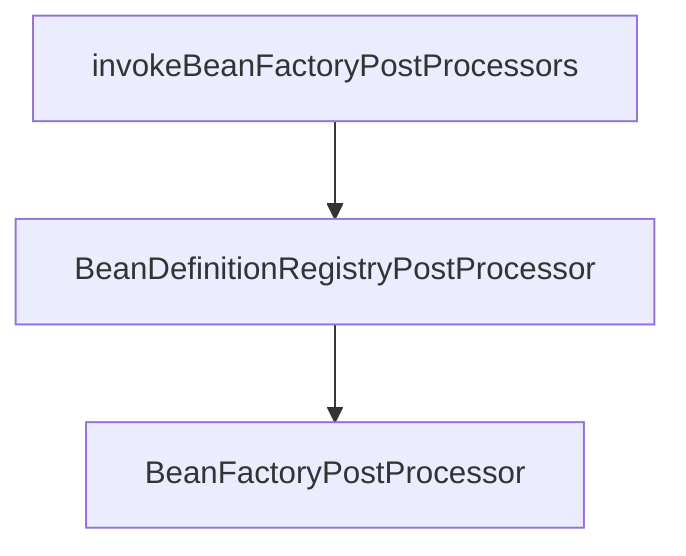

#### spring 中 invokeBeanFactoryPostProcessors(beanFactory);方法的处理

处理流程如下

##### 处理 BeanDefinitionRegistryPostProcessor

*  First, invoke the BeanDefinitionRegistryPostProcessors that implement PriorityOrdered.
*  Next, invoke the BeanDefinitionRegistryPostProcessors that implement Ordered.
*  Finally, invoke all other BeanDefinitionRegistryPostProcessors until no further ones appear.

#####处理 BeanFactoryPostProcessor

*  First, invoke the BeanFactoryPostProcessors that implement PriorityOrdered.
*  Next, invoke the BeanFactoryPostProcessors that implement Ordered.
*  Finally, invoke all other BeanFactoryPostProcessors.

